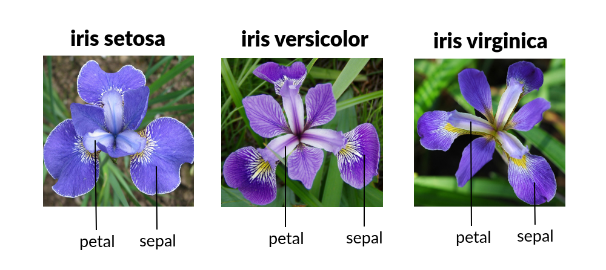
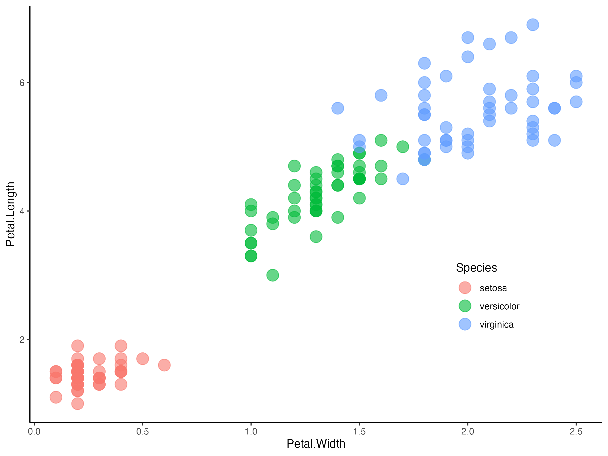
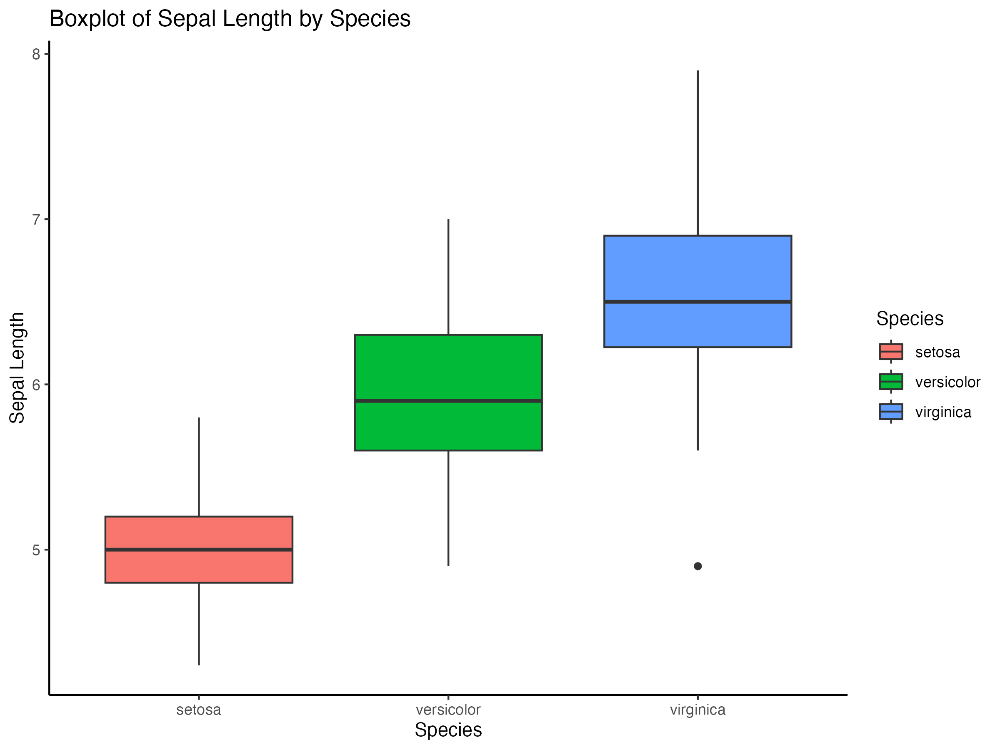
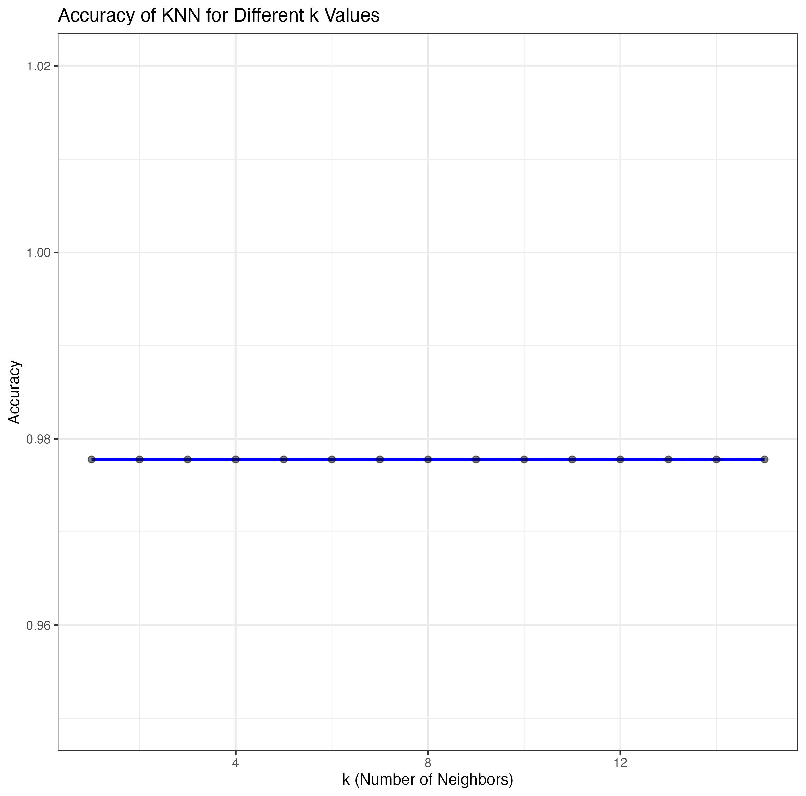
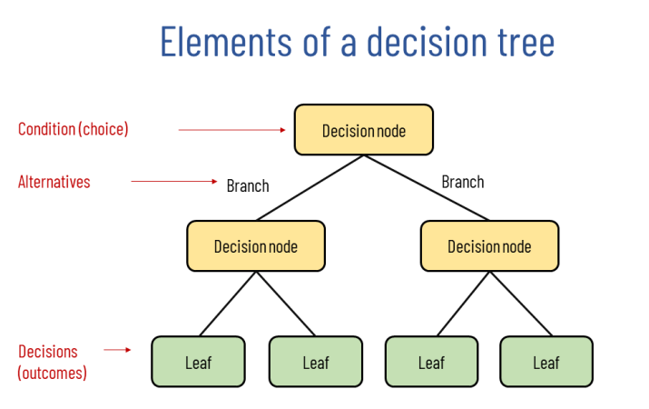
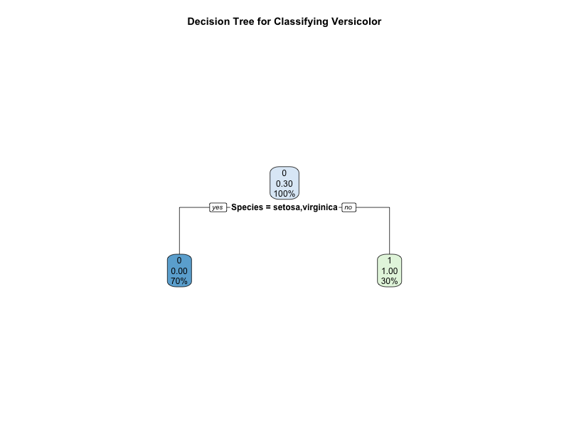
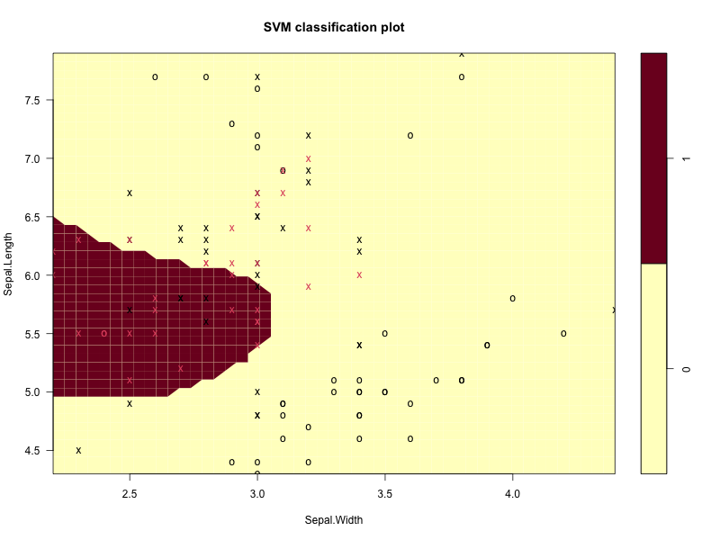
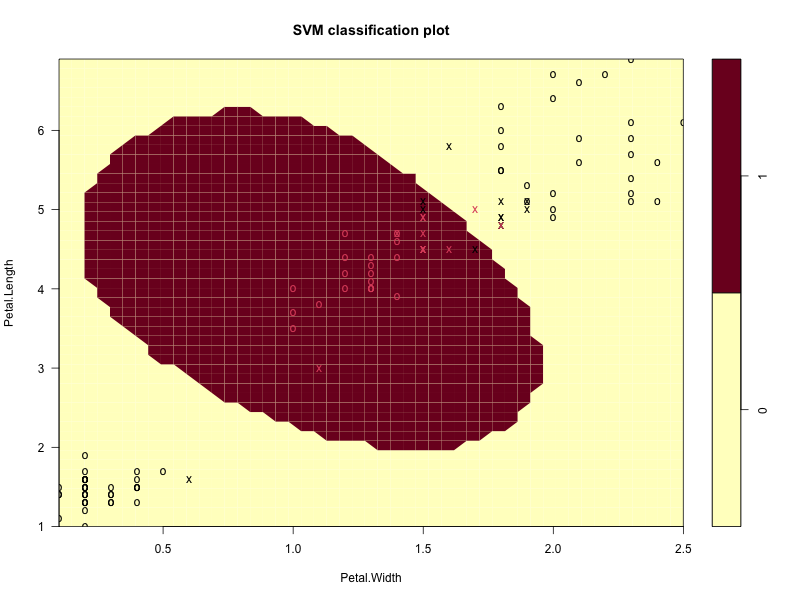
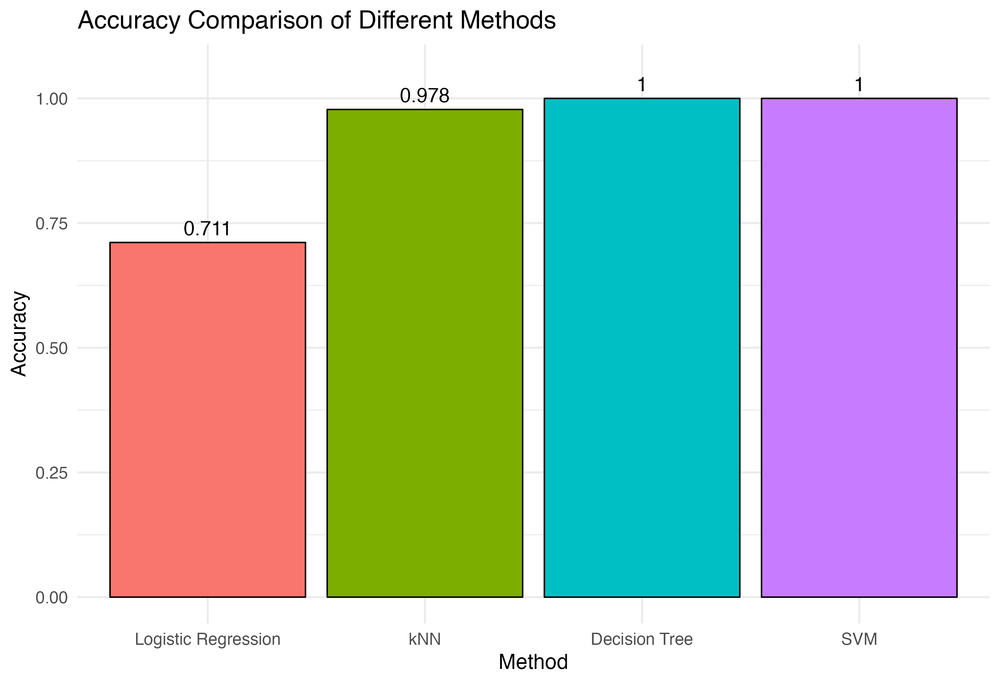

<center></center>

### Tutorial Aims

#### <a href="#section1"> 1. Introduction to Machine Learning</a>

#### <a href="#section2"> 2. Supervised Learning Algorithms</a>

##### <a href="#section2-1"> 2.1 Logistic Regression</a>

##### <a href="#section2-2"> 2.2 K-Nearest Neighbors (KNN)</a>

##### <a href="#section2-3"> 2.3 Decision Tree</a>

##### <a href="#section2-4"> 2.4 Support Vector Machines (SVM)</a>

#### <a href="#section3"> 3. Comparison and Summary</a>

<a name="section1"></a>

## 1. What is Machine Learning?

<a href="https://en.wikipedia.org/wiki/Machine_learning" target="_blank">Machine learning (ML)</a> is a field of study in artificial intelligence concerned with the development and study of statistical algorithms that can learn from data and generalize to unseen data, and thus perform tasks without explicit instructions. Today,this technologies have become some of the biggest players in the world of artificial intelligence and computer science.\
In other words, just like repeatly showing items to a children to help them recognise, Machine Learning makes computers more intelligent without explicitly teaching them how to behave.

There are **four types** of Machine Learning algorithms,

| Types | Description |
|----------------------------|--------------------------------------------|
| <a href="https://en.wikipedia.org/wiki/Machine_learning" target="_blank"> Supervised Learning</a> | Supervised learning involves training a model on labeled data, where the desired output is known. The model learns to map inputs to outputs based on the provided examples. |
| <a href="https://en.wikipedia.org/wiki/Unsupervised_learning" target="_blank">Unsupervised Learning</a> | Unsupervised learning works with unlabeled data and aims to find hidden patterns or intrinsic structures in the input data. |
| <a href="https://en.wikipedia.org/wiki/Reinforcement_learning" target="_blank">Reinforcement Learning</a> | Reinforcement learning involves training agents to make a sequence of decisions by rewarding them for good actions and penalizing them for bad ones. |
| <a href="https://en.wikipedia.org/wiki/Ensemble_learning" target="_blank">Ensemble Learning</a> | Ensemble learning combines multiple models to improve performance by leveraging the strengths of each model. |

### Have you ever wondered how to recognise different species of iris flowers?

<center></center>

While botanists use physical characteristics like petal and sepal measurements, in this tutorial, we will focus on teaching a computer to do the same! By leveraging the powerful R programming language, we’ll guide you through the process of using data analysis and classification techniques to identify iris species. Whether you’re a curious beginner or an experienced data enthusiast, this tutorial will equip you with the tools to build your own flower-recognition model.

The `Iris` dataset, a cornerstone in the field of data science and machine learning, serves as a classic example for exploring data analysis and classification techniques. Collected by the botanist *Edgar Anderson*, this dataset provides measurements of sepal and petal dimensions for three iris species: Iris setosa, Iris versicolor, and Iris virginica. In this tutorial, we will harness the power of R to classify iris flowers based on their unique features. Whether you're a beginner looking to enhance your R skills or a data enthusiast eager to delve into supervised learning, this guide will walk you through each step of the process, blending theory with practical implementation. **Again, in this tutorial, we will only cover four algorithms in supervised learning.**

##### Load packages

``` r
# Instal package if it's not done yet
install.packages('package name')

# Loading required packages for this tutorial
library(caret)
library(tidyverse) #data manipulation and visualization
library(dplyr)
library(ggplot2)
library(class) #basic KNN
library(randomForest) #Random Forest implementation
library(rpart)       # For decision tree
library(rpart.plot)  # For visualizing the tree
library(stats) # Logistic regression is included in base R through the glm() function.
library(e1071) #SVM
library(knitr)
```

##### Load dataset

``` r
# Loading iris dataset
iris.data <- iris

# Viewing iris dataset structure and attributes
str(iris.data)
```

There are 150 observations in total. Before we look into the algorithms, first take a brief look through the data set.

``` r
# Create a scatter plot
scatter_iris <- ggplot(iris.data, aes(x = Petal.Width, y = Petal.Length, color = Species)) +
  geom_point(size = 5, alpha = 0.6) +
  theme_classic() +
  theme(legend.position = c(0.8, 0.3))
scatter_iris  
  
# Create a boxplot for Sepal.Length by Species
boxplot_iris <- ggplot(iris.data, aes(x = Species, y = Sepal.Length, fill = Species)) +
  geom_boxplot() +
  labs(title = "Boxplot of Sepal Length by Species",
       x = "Species",
       y = "Sepal Length") +
  theme_classic()
boxplot_iris 
```

Ensure to call the plot name again so it can be displayed on the Plots panel.

<center></center>

<center></center>

From the above two plots, we can see the same species are tend to cluster together. Now we know that there is a clear difference in structural traits between species.

<a name="section2"></a>

## 2. Supervised Learning

Supervised learning uses a training set to teach models to yield the desired output. This training dataset includes inputs and correct outputs, which allow the model to learn over time. The algorithm measures its accuracy through the loss function, adjusting until the error has been sufficiently minimized.

In this section, we will train our models using four different algorithms to accurately recognize the species of iris flowers.

<a name="section2-1"></a>

## 2.1 Logistic Regression

While linear regression is leveraged when dependent variables are continuous, <a href="https://en.wikipedia.org/wiki/Logistic_regression" target="_blank">**logistic regression**</a> is selected when the dependent variable is categorical, meaning they have binary outputs, such as "true" and "false" or "yes" and "no." While both regression models seek to understand relationships between data inputs, logistic regression is mainly used to solve binary classification problems, such as iris species identification.

The logistic function, commonly referred to as the **sigmoid function**, is the basic idea underpinning logistic regression. This sigmoid function is used in logistic regression to describe the correlation between the predictor variables and the likelihood of the binary outcome.

<center></center>

Since this algorithm can only have binary output, for example, we can classify whether a iris flower is "versicolor" or "not versicolor" species.

1.  data preparation: create a binary variable `is_versicolor` where:

<div style="background-color: #e6f7ff; padding: 10px; border-radius: 5px;">
   
- `1` represents "versicolor".  
   
- `0` represents the other species ("setosa" and "virginica").
   
</div>

``` r
# Create a binary classification problem
iris.data$is_versicolor <- ifelse(iris$Species == "versicolor", 1, 0)
```

2.  Split Data into Training and Testing Sets

`set.seed()` ensures every time we use the same data for training and testing.

The **training set** is used to build the model, while the **test set** evaluates how well the model performs on unseen data. Split the data into a training set (70%) and a test set (30%).

``` r
set.seed(123)  # For reproducibility
train_index <- sample(1:nrow(iris), size = 0.7 * nrow(iris))  # 70% for training
train_data <- iris[train_index, ]
test_data <- iris[-train_index, ]
```

3.  Fit Logistic Regression Model

Use the `glm()` function with a `binomial` family for logistic regression. The model learns the relationship between the features and the target variable by estimating coefficients for each predictor.

``` r
# Fit logistic regression model
logistic_model <- glm(is_versicolor ~ Sepal.Length + Sepal.Width + Petal.Length + Petal.Width, 
                      data = train_data, 
                      family = binomial)

# Summary of the model
summary(logistic_model)
```

4.  Make Predictions

Use the `predict()` function to generate predicted probabilities for the test set. These **output probabilities** represent how likely each flower belongs to the "setosa" category. Convert probabilities to **binary** classifications (e.g., 1 if the probability is above 0.5, otherwise 0).

``` r
# Predict probabilities for the test set
predicted_probs <- predict(logistic_model, newdata = test_data, type = "response")

# Convert probabilities to binary predictions
predicted_classes <- ifelse(predicted_probs > 0.5, 1, 0)
```

5.  Evaluate the Model performance

`Confusion Matrix`: Summarizes the number of true positives, true negatives, false positives, and false negatives. Hint: for displaying table in html format or website, we could use the function `kable(..., format = "html")`

``` r
# Evaluate the model

CM_KNN <- confusionMatrix(as.factor(predicted_classes_knn), as.factor(test_data$is_versicolor))
CM_KNN$table
kable(CM_KNN$table, format = "html")

# Measure the accuracy
accuracy <- mean(predicted_classes == test_data$is_setosa)
print(paste("Accuracy:", round(accuracy * 100, 2), "%"))
```

##### Confusion Matrix

|     |   0 |   1 |
|:----|----:|----:|
| 0   |  24 |  10 |
| 1   |   3 |   8 |

From confusion matrix and `[1] "Accuracy: 71.11 %"` meaning that only part of the predictions were correct. Only 24 non-versicolors and 8 versicolors got correctly recognised. While the model performs well for identifying non-versicolor flowers, the number of correctly predicted "versicolor" flowers could be improved. You might consider adjusting the threshold for classification or tuning the model's parameters.

<a name="section2-2"></a>

## 2.2 K-Nearest Neighbors (KNN)

<a href="https://en.wikipedia.org/wiki/K-nearest_neighbors_algorithm" target="_blank">**K-nearest neighbor**</a>, also known as the KNN algorithm, is a non-parametric algorithm that classifies data points based on their proximity and association to other available data. This algorithm assumes that similar data points can be found near each other. As a result, it seeks to calculate the distance between data points, usually through Euclidean distance, and then it assigns a category based on the most frequent category or average. Its ease of use and low calculation time make it a preferred algorithm by data scientists, but as the test dataset grows, the processing time lengthens, making it less appealing for classification tasks. KNN is typically used for recommendation engines and image recognition.

<center></center>

In this example, we'll follow a similar approach to the logistic regression above, but using KNN for the classification. We'll use the `class` package to implement the KNN algorithm.

**We will use the same train and test data set**

1.  Fit KNN Model

We use the `knn()` function from the class package to fit the KNN model. In this case, we will choose **k = 3**, meaning the classification will be based on the 3 nearest neighbors.

``` r
# Train the KNN model
k_value <- 3  # Number of neighbors
predicted_classes_knn <- knn(train = train_data[, -c(5, 6)],  # Exclude Species and is_setosa columns
                             test = test_data[, -c(5, 6)], 
                             cl = train_data$is_setosa, 
                             k = k_value)

# View the predicted classes
predicted_classes_knn
```

2.  Evaluate the Model

We evaluate the model's performance using the confusion matrix to understand how well the KNN classifier performed on the test set.

``` r
# Evaluate the KNN model performance
CM_KNN <- confusionMatrix(as.factor(predicted_classes_knn), as.factor(test_data$is_versicolor))
CM_KNN$table

# Calculate accuracy
accuracy_knn <- mean(predicted_classes_knn == test_data$is_versicolor)
print(paste("Accuracy:", round(accuracy_knn * 100, 2), "%"))
```

##### Confusion Matrix

|     |   0 |   1 |
|:----|----:|----:|
| 0   |  27 |   1 |
| 1   |   0 |  17 |

`[1] "Accuracy: 97.78 %"` The model achieved a very high accuracy of 97.78%, indicating that it correctly classified nearly all instances in the test set.The model demonstrated minimal error, with only one false negative and no false positives, suggesting it is well-suited for this binary classification task.

Try different number of k:

``` r
# Create a vector to store accuracy values for each k
k_values <- 1:15  # Range of k to evaluate
accuracies <- numeric(length(k_values))  # Initialize vector for accuracies

# Loop through each k value
for (k in k_values) {
  # Apply KNN
  predicted_classes_knn <- knn(
    train = train_data[, -c(5, 6)],  # Exclude Species and is_versicolor columns
    test = test_data[, -c(5, 6)], 
    cl = train_data$is_versicolor, 
    k = k
  )
  
  # Calculate accuracy
  confusion_mat <- table(Prediction = predicted_classes_knn, Reference = test_data$is_versicolor)
  accuracy <- sum(diag(confusion_mat)) / sum(confusion_mat)  # Correct predictions / Total predictions
  accuracies[k] <- accuracy
}
```

Visualised into a line plot:

``` r
# Create a data frame for visualization
accuracy_data <- data.frame(k = k_values, Accuracy = accuracies)

# Plot the accuracies
KNN_plot <- ggplot(accuracy_data, aes(x = k, y = Accuracy)) +
  geom_line(color = "blue", linewidth = 1) +
  geom_point(color = "black", size = 2, alpha = 0.5) +
  labs(
    title = "Accuracy of KNN for Different k Values",
    x = "k (Number of Neighbors)",
    y = "Accuracy"
  ) +
  ylim(0.95, 1.02)+
  theme_bw()
KNN_plot
```

<center></center>

The accuracy of 97.78% across all k values indicates that the KNN model is **robust** for this classification task. While k selection typically matters in KNN, the lack of variation in accuracy here suggests that this dataset provides sufficient separation between classes to achieve consistent results, regardless of the number of neighbors considered.

In general, a simple approach to select k is set $k = \sqrt{n}$, where $n$ is the the number of samples in your training dataset. Remeber, it's better to have a odd number which prevent a tie situation if you only have two classes. A small value of k means that noise will have a higher influence on the result. A large value make it computationally expensive.

In order to find the optimal k value, use cross-validation (especially leave-one-out cross-validation) is needed to evaluate the model's performance for different k values instead of relying solely on the training or test data. This helps prevent overfitting and ensures the chosen k generalises well to new data.

For more detail, check the following links. <a href="https://en.wikipedia.org/wiki/Cross-validation_(statistics)" target="_blank">cross-validation</a>, <a href="https://medium.com/@rkbohara097/how-to-find-the-optimal-value-of-k-in-knn-2d5177430f2a" target="_blank">Finding optical K for KNN</a>

There is also a <a href="https://ourcodingclub.github.io/tutorials/machine-learning/#test">tutorial</a> in Coding Club regarding to KNN.

<a name="section2-3"></a>

## 2.3 Decision Tree

A <a href="https://en.wikipedia.org/wiki/Decision_tree" target="_blank">**decision tree**</a> is a map of the possible outcomes of a series of related choices. It allows an individual or organization to weigh possible actions against one another based on their costs, probabilities, and benefits. They can can be used either to drive informal discussion or to map out an algorithm that predicts the best choice mathematically.

It typically starts with a single node, which branches into possible outcomes. Each of those outcomes leads to additional nodes, which branch off into other possibilities. This gives it a treelike shape.

There are three different types of nodes: chance nodes, decision nodes, and end nodes. A chance node, represented by a circle, shows the probabilities of certain results. A decision node, represented by a square, shows a decision to be made, and an end node shows the final outcome of a decision path.

<center></center>

Let's use the same train data to Fit the Decision Tree Model.

1.  Fit the Decision Tree Model

``` r
decision_tree <- rpart(
  is_versicolor ~ .,  # Formula: Predicting is_versicolor based on all other variables
  data = train_data,  # Training data
  method = "class"    # Classification tree
)
```

2.  Before tasking the model performance, we can visualize the Decision Tree through function `rpart.plot()`. Unlike the previous used `ggsave()` for `ggplot()` to save the plot, here is another way.

``` r
png("decision_tree_plot.png", width = 800, height = 600)  # Set the file name and dimensions
rpart.plot(decision_tree, main = "Decision Tree for Classifying Versicolor")  # Plot the tree
dev.off()  # Close the graphics device
```

<center></center>

The decision tree classifies samples as versicolor (`1`) or not versicolor (`0`) based on Species. If Species is setosa or virginica, the prediction is 0, covering 70% of the samples. If it is not, the prediction is 1, covering the remaining 30%. This clear split shows Species is highly effective for classification.

3.  Make predictions

``` r
predicted_classes_dt <- predict(decision_tree, test_data, type = "class")
```

4.  Evaluate Model Performance

``` r
# confusion matrix
confusion_mat_dt <- confusionMatrix(as.factor(predicted_classes_dt), as.factor(test_data$is_versicolor))
print(confusion_mat_dt$table)

# Extract Accuracy
accuracy_dt <- confusion_mat_dt$overall["Accuracy"]
print(paste("Decision Tree Accuracy:", round(accuracy_dt * 100, 2), "%"))
```

|     |   0 |   1 |
|:----|----:|----:|
| 0   |  27 |   0 |
| 1   |   0 |  18 |

`[1] "Decision Tree Accuracy: 100 %"`

The decision tree model achieved a perfect classification. The confusion matrix shows no misclassifications: all 27 samples labeled as 0 (not versicolor) and all 18 samples labeled as 1 (versicolor) were correctly predicted. This indicates the model was able to fully utilize the feature Species to separate the classes without any errors, reflecting the strong separability of the data.

#### Expand

A <a href="https://en.wikipedia.org/wiki/Random_forest" target="_blank">**Random Forest**</a> is an ensemble method that builds multiple decision trees and combines their predictions to improve accuracy and reduce overfitting. The main idea behind random forests is:

<center></center>

-   **Bootstrapping (Random Sampling)**: Randomly sample subsets of the training data to build each tree, allowing the model to generalize better.
-   **Random Feature Selection**: For each split in a tree, select a random subset of features, making the trees less correlated with each other and enhancing the model's diversity.
-   **Majority Voting**: For classification problems, each tree in the forest votes on the class, and the class with the most votes is chosen as the final prediction.

Code example:

``` r
library(randomForest)
random_forest <- randomForest(is_versicolor ~ ., data = train_data)
predicted_classes_rf <- predict(random_forest, test_data)
```

For more detail, check the following <a href="https://www.rdocumentation.org/packages/randomForest/versions/4.7-1.2/topics/randomForest" target="_blank">link</a>.

<a name="section2-4"></a>

## 2.4 Support Vector Machines (SVM)

<a href="https://en.wikipedia.org/wiki/Support_vector_machine" target="_blank">**Support vector machine (SVM)**</a> is a popular supervised learning model developed by *Vladimir Vapnik*, used for both data classification and regression. That said, it is typically leveraged for classification problems, constructing a hyperplane where the **distance** between two classes of data points is at its **maximum**. This hyperplane is known as the decision boundary, separating the classes of data points (e.g., oranges vs. apples) on either side of the plane.

<center></center>

Again, we are using the same training and testing dataset for this case.

1.  Train an SVM Model

The use of `factor()` ensures the predictions are either 0 or 1. (otherwise would be non-integer) - `kernel = "radial"`: This specifies the radial basis function (RBF) kernel, which is commonly used for classification problems. - `scale = TRUE`: This scales the features to have zero mean and unit variance, which helps SVM perform better.

``` r
# Ensure that the outcome variable is a factor (classification)
train_data$is_versicolor <- factor(train_data$is_versicolor)
test_data$is_versicolor <- factor(test_data$is_versicolor)

# Train an SVM model using a radial basis function kernel (default kernel)
svm_model <- svm(is_versicolor ~ ., data = train_data, kernel = "radial",scale = TRUE)
```

2.  Make Predictions

``` r
predicted_classes_svm <- predict(svm_model, test_data)
```

3.  Evaluate Model Performance

``` r
# Confusion Matrix and Accuracy for SVM
CM_SVM <- confusionMatrix(as.factor(predicted_classes_svm), as.factor(test_data$is_versicolor))
CM_SVM$table
kable(CM_SVM$table, format = "html")

accuracy_svm <- CM_SVM$overall["Accuracy"]
```

|     |   0 |   1 |
|:----|----:|----:|
| 0   |  27 |   0 |
| 1   |   0 |  18 |

`[1] "SVM Accuracy: 100 %"`

The SVM model achieved 100% accuracy, meaning it correctly classified all instances in the test data. This suggests that the model has perfectly separated the classes in this dataset. However, it's important to note that perfect accuracy can sometimes indicate \*overfitting\*\*, especially if the dataset is small or simple, so it's always good to test the model on different data or use cross-validation to ensure robustness.

4.  Visualisation

If you are interested in how the SVM decision boundary looks, you can plot the decision boundary for the each two features (e.g., Sepal.Length and Sepal.Width) as an example. This visualization is only meaningful for datasets with 2 features.

``` r
# Reduce data to two features
# Sepal
Sepal_train_data <- train_data[, c(1, 2, 6)]
# Train new model
Sepal_svm_model <- svm(is_versicolor ~ ., data = Sepal_train_data, kernel = "radial", scale = TRUE)

png("Images/svm_Sepal_plot.png", width = 800, height = 600)  # Set the file name and dimensions
plot(Sepal_svm_model, Sepal_train_data)
dev.off()  # Close the graphics device

# Petal
Petal_train_data <- train_data[, c(3,4, 6)]
# Train new model
Petal_svm_model <- svm(is_versicolor ~ ., data = Petal_train_data, kernel = "radial", scale = TRUE)

png("Images/svm_Petal_plot.png", width = 800, height = 600)  # Set the file name and dimensions
plot(Petal_svm_model, Petal_train_data)
dev.off()  # Close the graphics device
```

<left></left> <right></right>

Based on the comparative analysis of SVM classification plots using different Iris flower measurements, we can conclude that petal characteristics (width and length) serve as substantially more reliable discriminative features than sepal measurements for species classification. While the sepal-based plot exhibits considerable overlap between classes and an irregular decision boundary, the petal-based plot demonstrates clear class separation, particularly for one species that forms a distinct cluster. This results also highlight the importance of feature selection in machine learning applications, as choosing the most informative features can significantly impact the model's performance and reliability.

For more detail, check the following <a href="https://scikit-learn.org/1.5/modules/svm.html" target="_blank">link</a>.

<a name="section3"></a>

## 3. Comparison and Summary

After all those practice, are you familiar with supervised learning algorithms now? Now, let's compare their performance.

``` r
# Create a data frame of accuracies
accuracy_df <- data.frame(
  Method = c("Logistic Regression", "kNN", "Decision Tree", "SVM"),
  Accuracy = c(accuracy_LR, accuracy_knn, accuracy_dt, accuracy_svm))

# Ensure the Method column has the specified order
accuracy_df$Method <- factor(accuracy_df$Method, levels = c("Logistic Regression", "kNN", "Decision Tree", "SVM"))

# Create a bar plot
ggplot(accuracy_df, aes(x = Method, y = Accuracy, fill = Method)) +
  geom_bar(stat = "identity", color = "black") +
  scale_y_continuous(limits = c(0, 1), breaks = seq(0, 1, 0.1)) +
  labs(
    title = "Accuracy Comparison of Different Methods",
    x = "Method",
    y = "Accuracy"
  ) +
  ylim(0, 1.055) +
  theme_minimal(base_size = 15) +
  theme(legend.position = "none") + # Hide legend as it's redundant
  geom_text(aes(label = round(Accuracy, 3)), vjust = -0.5, size = 5)
```

<center></center>

Both the Decision Tree and SVM models achieved perfect accuracy, indicating their strong performance for this dataset. The kNN method also performed impressively with near-perfect accuracy, making it a reliable choice. In contrast, Logistic Regression lagged behind, suggesting that it may not be the best choice for datasets with nonlinear relationships between features. Overall, the results highlight the importance of trying multiple algorithms to find the most suitable one for a given classification task. Further validation on a larger test set or through cross-validation is recommended to confirm the generalizability of these findings.

Choosing the best algorithm for a classification problem involves considering the characteristics of your dataset, the requirements of your task, and the strengths of various algorithms. Here is a general guide:

| Algorithm | Strengths | Limitations |
|------------------|-----------------------------|-------------------------|
| **Logistic Regression** | Simple, interpretable, good for linear relationships | Struggles with non-linear or complex data |
| **kNN** | Non-linear decision boundaries, simple to understand | Sensitive to noise, computationally expensive |
| **Decision Trees** | Interpretable, handles mixed data types | Prone to overfitting without pruning |
| **SVM** | Effective in high-dimensional spaces, robust | Computationally expensive, requires tuning |
| **Random Forest** | Reduces overfitting, works well on large datasets | Less interpretable, slower for large forests |

#### Summary

In this tutorial we have now covered the following:

1.  the very basics of machine learning in R

2.  implementing four classification algorithms

3.  building our own training and test datasets

4.  testing and evaluating our algorithms using iris data

However there is still a whole world to explore. For those interested in learning more have a look at this <a href="https://lgatto.github.io/IntroMachineLearningWithR/an-introduction-to-machine-learning-with-r.html" target="_blank">link</a>
